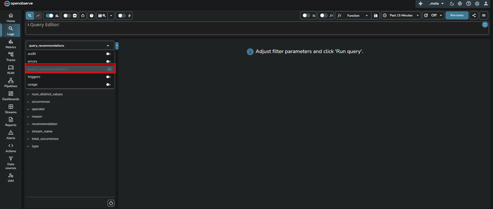

This document explains the function and application of the query_recommendations stream within the _meta organization in OpenObserve. It provides guidance for users who want to optimize query performance using system-generated recommendations based on observed query patterns.

!!! info "Availability"
    This feature is available in Enterprise Edition. 

## Overview
OpenObserve continuously analyzes user queries across streams to identify optimization opportunities. These suggestions are stored in the `query_recommendations` stream under the `_meta` organization. The recommendations focus on improving performance by suggesting secondary indexes when patterns in field access indicate consistent and potentially costly lookups.

!!! note "Where to find it"
    The query recommendations are published into the `query_recommendations` stream under the `_meta` organization.
    

!!! note "Who can access it"
    All Enterprise Edition users with access to the `_meta` organization can access the `query_recommendations` stream. 

!!! note "When to use it"
    Use this stream when:

    - You notice slow query performance for specific fields or patterns.
    - You are planning schema-level optimizations.
    - You want to validate whether frequently queried fields would benefit from indexing.

## How to use it
1. Switch to the `_meta` organization in OpenObserve.
2. Go to the **Logs** section.
3. From the stream selection dropdown, select the `query_recommendations` stream. 
4. Select the desired time range. 
5. Click **Run query**. 

## Field descriptions
| Field                 | Description                                                                 |
|-----------------------|-----------------------------------------------------------------------------|
| `_timestamp`          | Time when the recommendation was recorded.                                 |
| `column_name`         | Field name in the stream that the recommendation applies to.               |
| `stream_name`         | The stream where this field was queried.                                   |
| `all_operators`       | All operators observed for the field (example: =, >, <).                   |
| `operator`            | Primary operator considered for recommendation.                            |
| `occurrences`         | Number of times the field was queried with the specified operator.         |
| `total_occurrences`   | Total number of queries examined.                                           |
| `num_distinct_values` | Count of distinct values seen in the field.                                |
| `duration_hrs`        | Duration (in hours) over which this pattern was observed.                  |
| `reason`              | Explanation behind the recommendation.                                     |
| `recommendation`      | Specific action suggested (typically, create secondary index).             |
| `type`                | Always `SecondaryIndexStreamSettings` for this stream.                     |

## Examples and how to interpret them

**Example 1**  

This recommendation indicates that across the last 360000000 hours of query data, the job field in the `default` stream was queried with an equality (`=`) operator 1220 times out of 1220 total queries. Since all queries used this field with the `=` operator, a secondary index could improve performance.

!!! note "Interpretation"
    Add a secondary index on the `job` field in the `default` stream for improved performance.

 

**Example 2**  

This recommendation is for the `status` field in the `alert_test` stream. All 5 queries used `status` with an equality operator. Although the number is small, the uniform pattern indicates a potential for future optimization.

!!! note "Interpretation"
    Consider indexing status if query volume increases or performance becomes a concern.